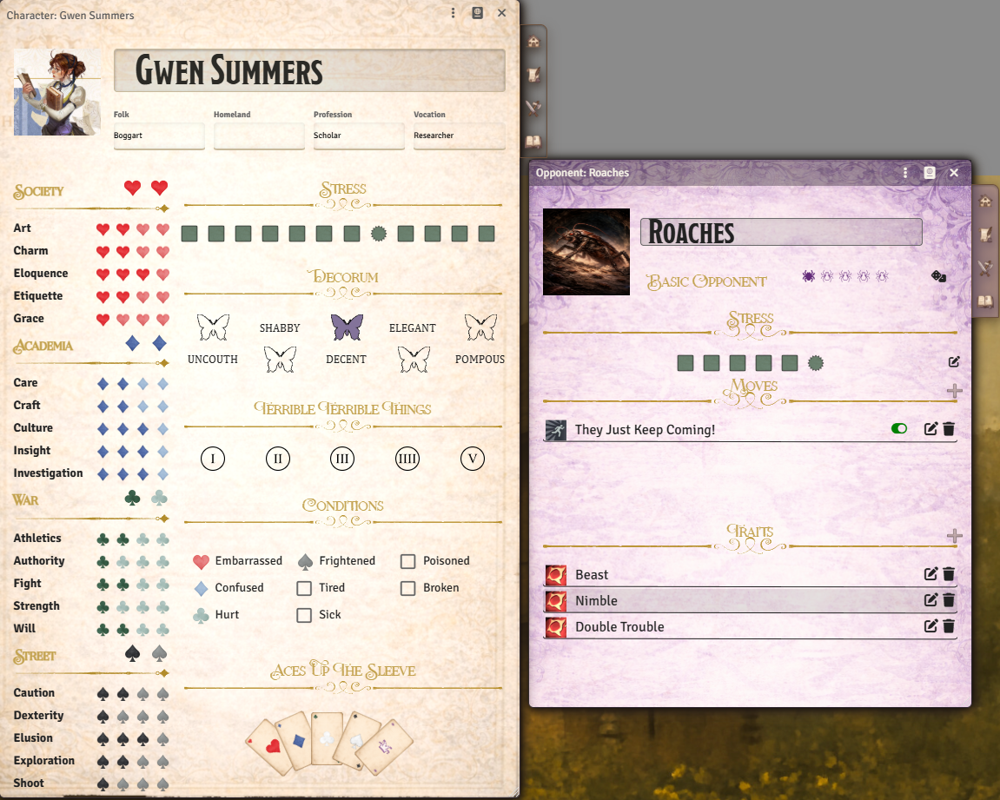
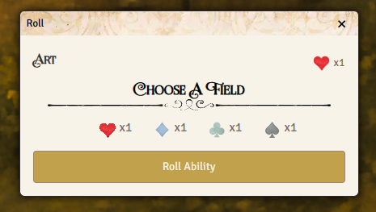
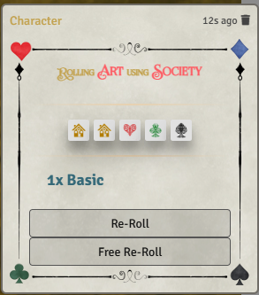
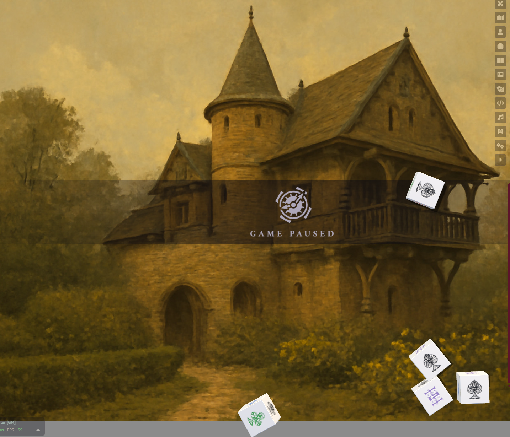
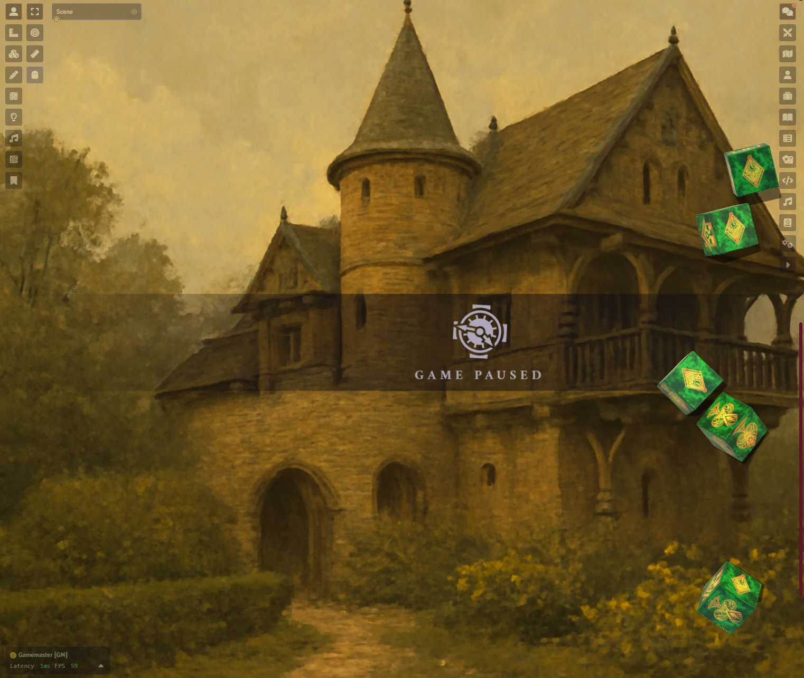

 

# Household RPG
Welcome to the unofficial Foundry VTT implementation for the Household RPG.

**Household RPG** is a trademark of Two Little Mice. While this system provides the necessary dice mechanics and character sheets for gameplay, the complete rules and item compendiums are available in the official books. For more information, please visit the [Two Little Mice website](https://twolittlemice.net/).

A quickstart guide for new players is available [here](https://www.drivethrurpg.com/en/product/421014/household-quickstart).

Please note that the images in the asset folder are sourced from the official game sheets and [Online Web Fonts](http://www.onlinewebfonts.com).

## Sheets
The system offers two types of sheets: Character sheets and Opponent sheets. The old NPC sheet is being phased out and will be removed in a future update.

 

## Item Types
The system includes the following item types:
- Generic Item
- Gadget
- Weapon
- Move
- Contract
- Trait
- Profession
- Vocation
- Companion
- Folk

## Rolls
The system features a roll dialog that allows players to select which skills and fields to use for their rolls.

 

Chat messages include options for players to re-roll, use a free re-roll, or go "all-in." All subsequent re-rolls are consolidated into the original chat message to keep the log clean.

 

## Dice So Nice
This system requires the [Dice So Nice](https://foundryvtt.com/packages/dice-so-nice/) module and includes two custom dice themes.

### Default Household Dice

### Household Garden Dice

