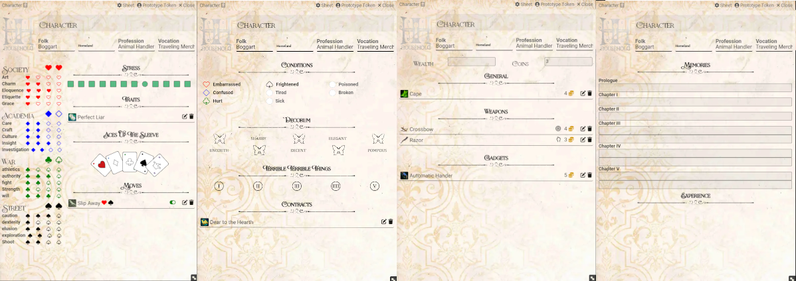

 
# Household RPG
Welcome to the unofficial implementation of the Household RPG for Foundry VTT.

**Household RPG** is a trademark of Two Little Mice. This system includes all the dice rolls and character sheets you need, but to access the complete rules and item lists, you'll need to purchase the official books. For more details, visit [Two Little Mice](https://twolittlemice.net/).

If you're new to **Household RPG**, a quickstart guide is available [here](https://www.drivethrurpg.com/en/product/421014/household-quickstart).

Please note that the images in the asset folder are sourced from the official game sheets and [Online Web Fonts](http://www.onlinewebfonts.com).

## Char Sheet
The image below displays the status of the character sheet (items are not included in the system; you will need to create them).

 

## Opponent Sheet
The image below displays the status of the opponent sheet (items and actions are not included in the system; you will need to create them).

## Rolls
The image below displays the status of the rolls (rolls, re-rolls, free-reroll, and all-in are supported).

 